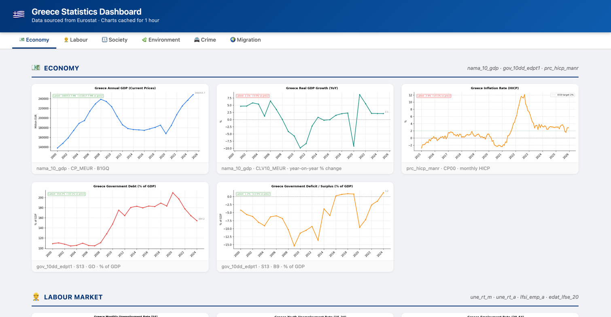

# Greece Statistics Dashboard 🇬🇷

A Flask + Matplotlib dashboard that pulls **live data from Eurostat** and renders it as a clean, sectioned web page.



---

## Indicators covered

| Section | Indicator | Eurostat dataset |
|---|---|---|
| **💶 Economy** | Annual GDP (current prices) | `nama_10_gdp` |
| | Real GDP growth (YoY %) | `nama_10_gdp` |
| | Inflation rate (HICP) | `prc_hicp_manr` |
| | Government debt (% of GDP) | `gov_10dd_edpt1` |
| | Government deficit / surplus (% of GDP) | `gov_10dd_edpt1` |
| **👷 Labour** | Monthly unemployment rate (SA) | `une_rt_m` |
| | Youth unemployment rate (15–24) | `une_rt_a` |
| | Employment rate (20–64) | `lfsi_emp_a` |
| | NEET rate (15–29) | `edat_lfse_20` |
| **👨‍👩‍👧 Society** | At-risk-of-poverty rate | `ilc_li02` |
| | Fertility rate | `demo_frate` |
| | Natural population change | `demo_gind` |
| **🌿 Environment** | Renewables share in final energy | `nrg_ind_ren` |
| **🚔 Crime** | Offences by category (homicide, robbery, theft, drugs) | `crim_off_cat` |
| | Prison population | `crim_pris_pop` |
| **🌍 Migration** | Foreign residents as % of population | `migr_pop1ctz` |
| | First-time asylum applications | `migr_asyappctza` |

---

## Features

- **6 grouped sections** — sticky nav bar jumps directly to Economy, Labour, Society, Environment, Crime, or Migration
- **Skeleton loading** — page appears instantly; charts pop in as data arrives
- **Delta badge on every chart** — shows the latest value and change vs the previous period
- **Reusable helpers** in `data_fetch.py` (`_melt_annual`, `_melt_monthly`, `_geo_col`) — adding a new indicator is ~5 lines
- **1-hour server-side cache** via Flask-Caching — Eurostat is queried once per server restart

---

## Run locally

**First time — create a virtual environment and install dependencies:**
```bash
cd eurostat-greece
python3 -m venv .venv
source .venv/bin/activate
pip install flask flask-caching matplotlib pandas eurostat
```

**Start the server:**
```bash
FLASK_DEBUG=0 python3 main.py
```

Open **[http://127.0.0.1:5001](http://127.0.0.1:5001)** in your browser.

> **Note:** port 5000 is reserved by macOS AirPlay Receiver — the app runs on **5001**.

> Charts load in the background (~1–2 min on first run). After that everything is instant from the cache.

**Subsequent runs:**
```bash
source .venv/bin/activate
FLASK_DEBUG=0 python3 main.py
```
